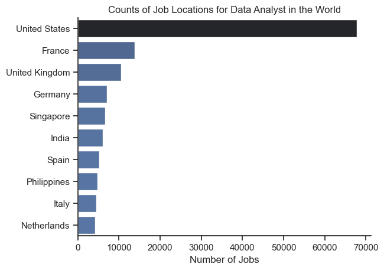

# Overview

This comprehensive analysis explores the global data analyst job market using real-world job posting data. The project investigates key aspects including job locations, company distributions, salary trends, and in-demand skills to provide actionable insights for data professionals worldwide.

The data sourced from [Luke Barousse's Python Course](https://lukebarousse.com/python) which provides a foundation for my analysis, containing detailed information on job titles, salaries, locations, and essential skills. Through a series of Python scripts, I explore key questions such as the most demanded skills, salary trends, and the intersection of demand and salary in data analytics.

# The Questions

Below are the questions I want to answer in my project:

1. Geographic Distribution: Which countries have the highest demand for data analysts?
2. Job Benefits: How common are remote work, degree requirements, and health insurance?
3. Company Analysis: Which companies hire the most data analysts globally?
4. Skill Demand: What skills are most requested in top data roles?
5. Skill Trends: How are in-demand skills evolving?
6. Salary Analysis: What are the salary distributions across data roles?
7. Skill Value: Which skills command the highest salaries?
8. Optimal Skills: Which skills offer the best combination of demand and compensation?

# Tools I Used

For my deep dive into the data analyst job market, I harnessed the power of several key tools:

- **Python:** The backbone of my analysis, allowing me to analyze the data and find critical insights.I also used the following Python libraries:
  - **Pandas Library:** This was used to analyze the data.
  - **Matplotlib Library:** I visualized the data.
  - **Seaborn Library:** Helped me create more advanced visuals.
- **Jupyter Notebooks:** The tool I used to run my Python scripts which let me easily include my notes and analysis.
- **Visual Studio Code:** My go-to for executing my Python scripts.
- **Git & GitHub:** Essential for version control and sharing my Python code and analysis, ensuring collaboration and project tracking.

# Data Preparation and Cleanup

This section outlines the steps taken to prepare the data for analysis, ensuring accuracy and usability.

## Import & Clean Up Data

I start by importing necessary libraries and loading the dataset, followed by initial data cleaning tasks to ensure data quality.

```python
# Importing necessary libraries
import ast  # For safely evaluating string representations of Python objects
import pandas as pd  # For data manipulation and analysis
import seaborn as sns  # For data visualization
from datasets import load_dataset  # For loading datasets from the Hugging Face Hub
import matplotlib.pyplot as plt  # For plotting graphs
from adjustText import adjust_text  # To prevent text overlap in plots

# Load the dataset from Hugging Face
dataset = load_dataset("lukebarousse/data_jobs")
# Convert the 'train' split of the dataset to a pandas DataFrame
df = dataset["train"].to_pandas()

# Convert the 'job_posted_date' column to datetime format for easier handling
df["job_posted_date"] = pd.to_datetime(df["job_posted_date"])

# Convert the 'job_skills' column from string to Python list (if not missing)
df["job_skills"] = df["job_skills"].apply(
    lambda x: ast.literal_eval(x) if pd.notna(x) else x
)
```

# The Analysis

Each Python file for this project aimed at investigating specific aspects of the data job market. Here’s how I approached each question:

## 1. What are the top 10 countries with the most Data Analyst job postings?

To identify where Data Analyst roles are most concentrated, I filtered the dataset for Data Analyst positions and counted the number of job postings per country. The top 10 countries were visualized in a bar chart to show which regions are most actively hiring for this role.

View my code with detailed steps here: [1_Counts_of_Job_Locations_for_Data_analyst_in_the_World](1_Counts_of_Job_Locations_for_Data_analyst_in_the_World.py).

### Visualize Data

```python
# Set the visual style for the plot
sns.set_theme(style="ticks")

# Create a horizontal bar plot showing the number of jobs per country
sns.barplot(
    data=df_plot,
    x="count",  # Number of jobs (will be created by value_counts)
    y="job_country",  # Country name
    hue="count",  # Color bars by count (for visual effect)
    palette="dark:b_r",
    legend=False,  # Do not show the legend
)

# Remove the top and right spines from the plot for a cleaner look
sns.despine()

# Add a title and axis labels to the plot
plt.title("Counts of Job Locations for Data Analyst in the World")
plt.xlabel("Number of Jobs")
plt.ylabel("")  # No label for y-axis (country names are self-explanatory)

# Display the plot
plt.show()
```

### Results



_Bar chart showing the number of Data Analyst job postings by country._

### Insights:

- The United States leads with the highest number of Data Analyst job postings, followed by countries like the United Kingdom and Canada.

- Most job postings are concentrated in English-speaking countries.

- There’s strong global demand, indicating wide-ranging opportunities across various regions.

## 2. What are the job benefit trends for Data Analyst roles?

To explore what job benefits are commonly offered to Data Analysts, I filtered the dataset accordingly and analyzed the distribution of remote work options, degree requirements, and health insurance availability. These were visualized with pie charts for better clarity.

View my notebook with detailed steps here: [2_Job_Details_Information](2_Job_Details_Information.py).

### Visualize Data

```python
# Create a figure with 1 row and 3 columns for the pie charts
fig, ax = plt.subplots(1, 3, figsize=(11, 3.5))

# Loop through each column and its title to create a pie chart
for i, (column, title) in enumerate(dict_column.items()):
    # Count the number of True/False values in the column and plot as a pie chart
    ax[i].pie(
        df_DA[column].value_counts(),
        labels=["False", "True"],  # Labels for the pie slices
        autopct="%1.1f%%",  # Show percentages on the chart
        startangle=90,  # Start the pie chart at 90 degrees
    )
    ax[i].set_title(title)  # Set the title for each pie chart

# Display the pie charts
plt.show()
```

### Results


_Pie charts showing the distribution of work-from-home options, degree requirements, and health insurance offerings._

### Insights:

- Over 60% of Data Analyst job postings do not mention a degree requirement, suggesting growing flexibility in education requirements.

- Nearly half of the jobs offer remote work options, indicating increased opportunities for flexible work environments.

- Health insurance is provided in a significant number of job listings, highlighting it as a common benefit.

## 3. Which companies are hiring the most Data Analysts globally?

To find out which companies are hiring the most Data Analysts, I analyzed a dataset of job postings and aggregated the number of roles per company. The top 10 companies were visualized in a bar chart.

View my notebook with detailed steps here: [3_Counts_of_Companies_for_Data_Analyst_in_the_World](3_Counts_of_Companies_for_Data_Analyst_in_the_World.py).

#### Visualize Data

```python
# Set the theme for the plot
sns.set_theme(style="ticks")

# Create a horizontal bar plot showing the number of Data Analyst jobs per company
sns.barplot(
    data=df_plot,
    x="count",  # Number of jobs
    y="company_name",  # Company names
    hue="count",  # Color bars by count (for visual effect)
    palette="dark:b_r",  # Color palette
    legend=False,  # Do not show legend
)

# Remove the top and right spines from the plot for a cleaner look
sns.despine()

# Add a title and axis labels to the plot
plt.title("Counts of Companies for Data Analyst in the World")
plt.xlabel("Number of Jobs")
plt.ylabel("")  # No label for y-axis (company names are self-explanatory)

# Display the plot
plt.show()
```

#### Results

  
_Bar chart showing the companies with the highest number of Data Analyst job postings._

#### Insights

- Large tech and consulting firms dominate the top of the list.

- The presence of multiple companies with similar posting volumes suggests a competitive hiring market.

- Consistent demand across different industries implies versatility in Data Analyst roles.

## 4. What are the most requested skills in the top 3 data analytics job titles?

To determine which skills are most sought after in data analytics roles, I identified the top 3 job titles based on frequency and calculated how often each skill appears within postings for those titles. The results were visualized using horizontal bar plots showing the percentage of postings mentioning each skill.

View my codes with detailed steps here: [4_Likehood_of_Skills_Requested_in_top_3_World's_Data_Analytics_Job_Postings](4_Likehood_of_Skills_Requested_in_top_3_World's_Data_Analytics_Job_Postings.py).

#### Visualize Data

```python
# Create a subplot for each of the top 3 job titles
fig, ax = plt.subplots(len(job_titles), 1)

# Set the visual style for the plots
sns.set_theme(style="ticks")

# Loop through each top job title to create a bar plot of its top 5 skills
for i, job_title in enumerate(job_titles):
    # Select the top 5 skills for the current job title
    df_plot = df_skills_percent[df_skills_percent.job_title_short == job_title].head(5)
    # Create a horizontal bar plot showing the percentage of postings for each skill
    sns.barplot(
        data=df_plot,
        x="skill_percent",
        y="job_skills",
        ax=ax[i],
        hue="skill_count",  # Color bars by skill count
        palette="dark:b_r",
        legend=False,
    )
    ax[i].set_ylabel("")  # Remove y-axis label for clarity
    ax[i].set_xlabel("")  # Remove x-axis label for clarity
    ax[i].set_xlim(0, 78)  # Set x-axis limits for consistency
    if i != len(job_titles) - 1:
        ax[i].set_xticks([])  # Hide x-axis ticks except for the last plot

    # Add text labels showing the exact percentage next to each bar
    for j, v in enumerate(df_plot.skill_percent):
        ax[i].text(v + 1, j, f"%{v:.2f}", va="center")

# Add a main title to the figure
fig.suptitle(
    "Likehood of Skills Requested in top 3 world's Data Analytics Job Postings"
)
# Adjust layout to prevent overlap
fig.tight_layout()
```

#### Results

  
_Bar graphs showing the top 5 skills for each of the 3 most common data analytics job titles._

#### Insights:

- SQL is the most requested skill across all three top job titles.

- Python consistently appears in the top skills, especially for technical roles like Data Scientist and Data Engineer.

- Business Intelligence tools (Tableau, Power BI) are more prominent in analyst positions than in engineering roles.

## 5. What are the trending top skills for Data Analysts throughout 2023?

To track skill demand trends over time, I analyzed monthly changes in how frequently top skills were mentioned in Data Analyst job postings. The top 5 trending skills were visualized using a line plot over the months of 2023.

View my codes with detailed steps here: [5_Trending_Top_Skills_for_Data_Analysts_in_the_World](5_Trending_Top_Skills_for_Data_Analysts_in_the_World.py).

#### Visualize Data

```python
# Plot the trends of the top 5 skills over the months
sns.lineplot(data=df_plot, dashes=False, palette="tab10")
sns.set_theme(style="ticks")

plt.title("Trending Top Skills for Data Analysts in the World")  # Set plot title
plt.ylabel("Likehood in Job Postings")  # Set y-axis label
plt.xlabel("2023")  # Set x-axis label
plt.legend().remove()  # Remove the legend for a cleaner look

# Add skill names at the end of each line for clarity
for i in range(5):
    plt.text(11.2, df_plot.iloc[-1, i], df_plot.columns[i])

sns.despine()  # Remove the top and right spines from the plot

from matplotlib.ticker import PercentFormatter

# Format the y-axis to show percentages (no decimal places)
ax = plt.gca()
ax.yaxis.set_major_formatter(PercentFormatter(decimals=0))
```

#### Results

  
_Line plot visualizing the monthly percentage of postings requesting each of the top 5 Data Analyst skills in 2023._

#### Insights:

- SQL and Excel remain steadily in high demand throughout the year.

- Python showed a slight upward trend, suggesting increasing relevance in analyst roles.

- Tableau and Power BI maintained a consistent presence, indicating their ongoing value in visualization and dashboarding.

## 6. What is the salary distribution across top data job roles?

This analysis explored the salary distribution for the six most common job titles in data careers. Using a boxplot, I visualized median, range, and outliers in yearly salary data.

View my codes with detailed steps here: [6_Salary_Distribution_in_the_World](6_Salary_Distribution_in_the_World.py).

#### Visualize Data

```python
# Create a boxplot to show the salary distribution for each of the top 6 job titles
sns.boxplot(
    data=top_6, x=top_6.salary_year_avg, y=top_6.job_title_short, order=job_order
)

# Set the visual theme for the plot
sns.set_theme(style="ticks")

# Set the title and axis labels for the plot
plt.title("Salary Distribution in the World")
plt.xlabel("Yearly Salary ($USD)")
plt.ylabel("")

# Format the x-axis to show salaries in thousands (e.g., $100K)
ax = plt.gca()
ax.xaxis.set_major_formatter(plt.FuncFormatter(lambda x, pos: f"${int(x/1000)}K"))

# Set the x-axis limits to show salaries from $0 to $600,000
plt.xlim(0, 600000)

# Display the plot
plt.show()
```

#### Results

  
_Boxplot displaying salary distributions for the top 6 data job titles._

#### Insights:

- Data Engineers and Machine Learning Engineers tend to earn higher median salaries than other roles.

- Data Analysts and BI Analysts show tighter salary ranges, suggesting more standardized pay scales.

- Outliers exist in all roles, indicating variability depending on experience, location, or company.

## 7. What are the highest paying and most in-demand skills for Data Analysts?

To evaluate which skills offer the best compensation and which are most frequently requested, I analyzed job postings for Data Analysts. I created two lists: (1) top 10 highest paid skills and (2) top 10 most in-demand skills, and visualized them using comparative bar plots.

View my codes with detailed steps here: [7_Top_10_Highest_Skills_for_Data_Analyst](7_Top_10_Highest_Skills_for_Data_Analyst.py).

#### Visualize Data

```python
# Create two subplots (one above the other)
fig, ax = plt.subplots(2, 1)
# Set the visual style for the plots
sns.set_theme(style="ticks")

# Plot the top 10 highest paid skills
sns.barplot(
    data=df_da_top_pay,
    x="median",  # Median salary on the x-axis
    y=df_da_top_pay.index,  # Skill names on the y-axis
    ax=ax[0],
    hue="median",  # Color bars by median salary
    palette="dark:blue_r",
    legend="",  # No legend
)

# Plot the top 10 most in-demand skills
sns.barplot(
    data=df_da_skills,
    x="median",  # Median salary on the x-axis
    y=df_da_skills.index,  # Skill names on the y-axis
    ax=ax[1],
    hue="median",  # Color bars by median salary
    palette="light:blue",
    legend="",  # No legend
)

# Make sure both plots have the same x-axis range for easy comparison
ax[1].set_xlim(ax[0].get_xlim())

# Set titles and labels for the first plot (highest paid skills)
ax[0].set_title("Top 10 Highest Paid Skills for Data Analyst")
ax[0].set_xlabel("")
ax[0].set_ylabel("")
# Format x-axis labels as thousands of dollars (e.g., $80K)
ax[0].xaxis.set_major_formatter(plt.FuncFormatter(lambda x, _: f"${int(x/1000)}K"))

# Set titles and labels for the second plot (most in-demand skills)
ax[1].set_title("Top 10 Most in Demand Skills for Data Analyst")
ax[1].set_xlabel("")
ax[1].set_ylabel("")
# Format x-axis labels as thousands of dollars
ax[1].xaxis.set_major_formatter(plt.FuncFormatter(lambda x, _: f"${int(x/1000)}K"))

# Adjust layout so plots don't overlap
fig.tight_layout()
```

#### Results

  
_Two horizontal bar plots: one for top-paying skills and another for most in-demand skills based on median salary._

#### Insights:

- Databricks, Airflow, and Scala are among the highest paying skills for Data Analysts.

- SQL and Excel are the most in-demand, but their median salaries are lower compared to more niche technical tools.

- Some skills like Python and Power BI offer a good balance between demand and salary.

## 8. What are the most optimal skills for Data Analysts?

This analysis identifies skills that are both highly demanded and well-compensated in Data Analyst roles. Skills were visualized in a scatter plot based on how common they are in job postings and their median salary, with color-coding by technology domain.

View my codes with detailed steps here: [8_Most_Optimal_Skills_for_data_analyts_ind_the_world](8_Most_Optimal_Skills_for_data_analyts_ind_the_world.py).

#### Visualize Data

```python
# Create scatter plot: skill percent vs. median salary, colored by technology
sns.scatterplot(
    data=df_DA_skills_tech_high_demand_unique,
    x="skill_percent",
    y="median_salary",
    hue="technology",
)

sns.despine()  # Remove top/right plot borders
sns.set_theme(style="ticks")  # Set plot style

# Prepare skill labels for each point
texts = []
for idx, row in df_DA_skills_tech_high_demand_unique.iterrows():
    texts.append(plt.text(row["skill_percent"], row["median_salary"], row["skills"]))

# Adjust text labels to avoid overlap
adjust_text(texts, arrowprops=dict(arrowstyle="->", color="gray"))

# Set axis labels, plot title, and legend
plt.xlabel("Percent of Data Analyst Jobs")
plt.ylabel("Median Yearly Salary")
plt.title("Most Optimal Skills for Data Analysts in the World")
plt.legend(title="Technology")

from matplotlib.ticker import PercentFormatter

# Format y-axis as $K and x-axis as percent
ax = plt.gca()
ax.yaxis.set_major_formatter(plt.FuncFormatter(lambda y, pos: f"${int(y/1000)}K"))
ax.xaxis.set_major_formatter(PercentFormatter(decimals=0))

# Adjust layout and show the plot
plt.tight_layout()
plt.show()
```

#### Results

  
_Scatter plot showing the trade-off between skill popularity and median salary for Data Analyst roles, grouped by technology._

#### Insights:

- Python and SQL strike an excellent balance between high demand and competitive pay.

- Less common but highly paid skills like Databricks and Airflow fall into specialized technology groups.

- Skills from business intelligence tools (Tableau, Power BI) are widely demanded and cluster in the moderate salary range.

# What I Learned

Throughout this project, I deepened my understanding of the data analyst job market and enhanced my technical skills in Python, especially in data manipulation and visualization. Here are a few specific things I learned:

- **Advanced Python Usage**: Utilizing libraries such as Pandas for data manipulation, Seaborn and Matplotlib for data visualization, and other libraries helped me perform complex data analysis tasks more efficiently.
- **Data Cleaning Importance**: I learned that thorough data cleaning and preparation are crucial before any analysis can be conducted, ensuring the accuracy of insights derived from the data.
- **Strategic Skill Analysis**: The project emphasized the importance of aligning one's skills with market demand. Understanding the relationship between skill demand, salary, and job availability allows for more strategic career planning in the tech industry.

# Insights

This project provided several general insights into the data job market for analysts:

- **Skill Demand and Salary Correlation**: There is a clear correlation between the demand for specific skills and the salaries these skills command. Advanced and specialized skills like Python and Oracle often lead to higher salaries.
- **Market Trends**: There are changing trends in skill demand, highlighting the dynamic nature of the data job market. Keeping up with these trends is essential for career growth in data analytics.
- **Economic Value of Skills**: Understanding which skills are both in-demand and well-compensated can guide data analysts in prioritizing learning to maximize their economic returns.

# Challenges I Faced

This project was not without its challenges, but it provided good learning opportunities:

- **Data Inconsistencies**: Handling missing or inconsistent data entries requires careful consideration and thorough data-cleaning techniques to ensure the integrity of the analysis.
- **Complex Data Visualization**: Designing effective visual representations of complex datasets was challenging but critical for conveying insights clearly and compellingly.
- **Balancing Breadth and Depth**: Deciding how deeply to dive into each analysis while maintaining a broad overview of the data landscape required constant balancing to ensure comprehensive coverage without getting lost in details.

# Conclusion

This exploration into the data analyst job market has been incredibly informative, highlighting the critical skills and trends that shape this evolving field. The insights I got enhance my understanding and provide actionable guidance for anyone looking to advance their career in data analytics. As the market continues to change, ongoing analysis will be essential to stay ahead in data analytics. This project is a good foundation for future explorations and underscores the importance of continuous learning and adaptation in the data field.
